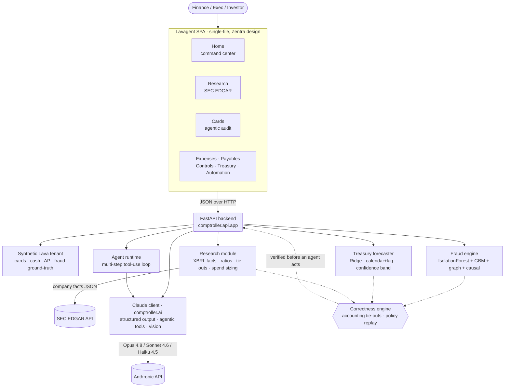

# Lavagent

**An AI-native spend-management platform — built for Lava.**

Lavagent is a working spend platform where Claude *acts* on live cards, cash, AP — and even
any US public company's SEC filings — but every action is grounded in real, verified
numbers. It scores each transaction for fraud, replays policy, forecasts cash with a real
ML model, sizes savings opportunities, and **tie-out-verifies every figure** — so an
autonomous finance agent can act without the risk of approving a fraudulent charge or
trusting a made-up number.

🔗 **Live demo:** [lavagent.up.railway.app](https://lavagent.up.railway.app)

It runs **fully offline** on deterministic ML; set `ANTHROPIC_API_KEY` and the whole AI
layer lights up with live **Claude Opus 4.8 / Sonnet 4.6 / Haiku 4.5** — structured
outputs, agentic tool-use, and vision.

```bash
pip install -r requirements.txt
uvicorn comptroller.api.app:app --reload      # → http://127.0.0.1:8000
```

---

## Architecture



Everything is deterministic and reproducible from a seed. The ML trains, the agents run,
the SEC data is real — nothing here is a mock.

---

## The product — 8 tabs

Grouped in the sidebar as **Overview**, **Spend**, and **Intelligence**:

| Group | Tab | What it does |
|---|---|---|
| **Overview** | **Home** | Command center — cash, net burn, runway, spend, in-policy %, value identified; ML cash forecast; CFO morning brief; needs-attention insights. **Search any public company** and Home *becomes* that company's financial command center. |
| | **Research** | Pull any US public company's as-filed SEC EDGAR financials, recompute ratios + accounting tie-outs, size the Lava spend opportunity, open the actual 10-K, get an AI improvement plan, and **deploy an agentic workflow**. |
| | **Cards** | Card portfolio + **Lava AI card intelligence** (ask about card spend) + a **6-tool agentic card audit** (out-of-policy, duplicate SaaS, over-provisioned limits, receipt gaps → projected savings). |
| **Spend** | **Expenses** | Transactions, categories, subscriptions, duplicates, policy compliance, anomalies. |
| | **Payables** | Duplicate-invoice + bank-change detection, vendor concentration (HHI), payment-timing / float. |
| **Intelligence** | **Controls** | Fraud alerts, fraud rings, counterfactual causal explanations, policy replay. |
| | **Treasury** | Reconstructed daily cash balance, a **real ML forecast with a confidence band** (~6% backtest error), runway, liquidity-shortfall date, and an idle-cash yield sweep. |
| | **Automation** | Action inbox / scheduled workflows surfaced by the agents. |

---

## Marquee capabilities

**Company research on live SEC filings.** Search any US public company → Lavagent fetches
its `companyfacts` XBRL from SEC EDGAR, builds a 6-year series, **recomputes the ratios and
accounting tie-outs** (Assets = Liabilities + Equity, to the dollar), links to the actual
10-K document, and sizes exactly what Lava would save them (addressable spend + savings
levers). Then Claude runs an **autonomous agentic workflow** — pull the breakdown,
consolidate SaaS, renegotiate rates, tighten policy, sweep idle cash — and reports every
action and the annual saving.

**Agentic card audit.** A tool-using Claude agent audits the live card program in one
click: it pulls the portfolio, detects out-of-policy spend, finds duplicate SaaS bought
per-seat across many cards, right-sizes over-provisioned limits, checks receipt
compliance, and projects total annual savings + risk-exposure reduction — every figure
grounded in the dataset.

**Treasury & cash-flow forecasting.** Reconstructs the daily Lava Cash balance from
money-movement and forecasts it forward with a **Ridge model over calendar + lag
features**, a widening confidence band, a backtested MAPE (~6%), runway, a
liquidity-shortfall date, and an idle-cash yield sweep into a government MMF (~4% APY).

**Fraud & graph intelligence.** A blended anomaly + supervised ensemble
(IsolationForest + Gradient Boosting, ROC-AUC ≈ 0.9) over behavioral, velocity and
**graph** features; links cards by shared devices / cross-metro IPs to surface fraud
rings; every alert gets **counterfactual causal drivers** and an action.

**Lava AI, everywhere.** A conversational agent scoped per page, a CFO morning brief that
reads live spend data, per-company improvement plans — all through the Anthropic SDK with
**structured outputs**, **adaptive thinking / effort** (Opus & Sonnet), and **vision**
(receipt autopilot).

---

## The correctness layer

The same engine that scores a charge proves the numbers behind it. Accounting identities
and policy are enforced at the decision layer, and a **financial-correctness eval
leaderboard** grades every backend against held-out ground truth (bootstrap CI, cost,
latency) — the deterministic engine is the reference, and models are ranked on how
faithfully they reproduce a controller's judgment.

| Model | Type | Task | Metric |
|---|---|---|---|
| Fraud ensemble | IsolationForest + Gradient Boosting | card fraud | ROC-AUC ≈ 0.9 |
| Credit-risk PD | Gradient Boosting | underwriting loss | ROC-AUC ≈ 0.94 |
| Treasury forecaster | Ridge (calendar + lag) | cash-flow / runway | backtest MAPE ≈ 6% |
| Fraud-ring graph | networkx components | collusion rings | shared-device clusters |
| Recurring detector | inter-arrival cadence | SaaS subscriptions | redundant-license savings |

---

## Run it

**Local**
```bash
pip install -r requirements.txt
uvicorn comptroller.api.app:app --reload      # http://127.0.0.1:8000
pytest -q                                     # 91 tests, fully offline
```

**Docker**
```bash
docker build -t lavagent .
docker run -p 8000:8000 -e ANTHROPIC_API_KEY=sk-ant-... lavagent
```

**Railway** — push to GitHub; Railway builds the included `Dockerfile` (Python 3.11), then
add `ANTHROPIC_API_KEY` under the service's **Variables**. The site loads without a key;
the AI/agent features need it.

A few of the 64 endpoints:
```
GET  /                                     # the Lavagent SPA
GET  /api/dashboard  /api/cards  /api/transactions
GET  /api/research/search  /api/research/company/{ticker}
POST /api/research/improve  /api/research/agent      # AI plan · agentic workflow
POST /api/cards/agent                                 # agentic card audit
GET  /treasury/forecast  /fraud/alerts  /fraud/rings
POST /api/ai/brief                          ·   docs at /docs
```

---

## Going live with Claude

Set `ANTHROPIC_API_KEY` and the AI surfaces call Claude through the Anthropic SDK with
**structured outputs**, **adaptive thinking + effort** (Opus 4.8 / Sonnet 4.6 think
adaptively; Haiku 4.5 runs lean), and an **agentic tool-use loop** for the card and
research workflows. Cost and latency are tracked per call.

---

## The monetization layer — a TypeScript LLM gateway

Lavagent's Claude calls route through a self-built **[LLM gateway](gateway/README.md)** written in
**TypeScript / Node** — the same shape as a production LLM-billing platform. It puts one endpoint
in front of every provider (`claude-*` → Anthropic, `gpt-*` → OpenAI-compatible, else a
deterministic offline backend), **meters every request** (tokens · latency · cost), attributes it
to a budget-limited **spend key**, enforces the budget (`402` once exhausted), and rolls usage into
an **invoice** with a gateway fee.

```bash
cd gateway && npm install && npm start     # → http://localhost:8787
npm test                                    # 12 tests, fully offline · npm run typecheck
```

The app points the Anthropic SDK at the gateway with two env vars — it then holds only a Lava
spend key while the gateway holds the provider credentials (no key sprawl):

```bash
export LAVA_GATEWAY_URL=http://localhost:8787/anthropic   # transparent Anthropic proxy
export LAVA_SPEND_KEY=lava_sk_demo_key
```

Every metered request also returns its usage on `x-lava-*` response headers
(`x-lava-cost-usd`, `x-lava-input-tokens`, `x-lava-latency-ms`, `x-lava-balance-remaining`).
Full API and design notes in **[gateway/README.md](gateway/README.md)**.

---

## Repo layout

```
comptroller/
  domain/      Lava primitives (Card, Cash, disputes, policy) + the rule engine
  data/        deterministic synthetic-tenant generator (spend, fraud, cash, GT)
  fraud/       entity graph · features · ML ensemble · causal explainer · pipeline
  analytics/   forecasting · underwriting · spend · ap · model registry
  research/    SEC EDGAR client · XBRL company facts · ratios · tie-outs · spend sizing
  agents/      evaluable agents + orchestrator + investigator + tools
  ai/          Claude client — vision · agentic tool-use · structured outputs
  llm/         backend abstraction: analytical · simulated · live Claude
  eval/        scorers · tasks · harness · correctness leaderboard
  api/         FastAPI service + the single-file Lavagent SPA (app.html)
  reporting.py · cli.py
scripts/       demo · train_fraud (CV) · run_eval
tests/         offline test suite (91 passing)
```

See [ARCHITECTURE.md](ARCHITECTURE.md) for the design deep-dive.

Built by Harshini Vijaya Kumar as a Lava-specific demonstration of production-quality
AI-finance + evaluation engineering.
